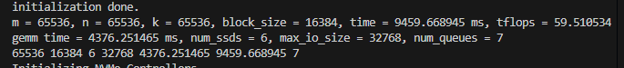

# Evaluation

**Important:** Please see [INSTALL.md](./INSTALL.md) for install dependencies and build CAM on a single machine. 

## 1. CAM Throughput Microbenchmark

This is the evalution for fig.8 in the paper.

### 1.1 Run the Random Read Benchmark

~~~bash
cd build/benchmarks/CAM_benchmark
sudo ./test_random_read
~~~

Firstly, the otput will be like this, which means SSDs are initialized.
~~~
Initializing NVMe Controllers
Attaching to 0000:50:00.0
Attaching to 0000:57:00.0
Attaching to 0000:66:00.0
Attaching to 0000:68:00.0
Attaching to 0000:9c:00.0
Attaching to 0000:9d:00.0
Attaching to 0000:e3:00.0
Attaching to 0000:e4:00.0
Attaching to 0000:e5:00.0
attach_cb 
Attached to 0000:68:00.0
  Namespace ID: 1 size: 3840GB
attach_cb 
Attached to 0000:66:00.0
  Namespace ID: 1 size: 3840GB
attach_cb 
Attached to 0000:50:00.0
  Namespace ID: 1 size: 3840GB
attach_cb 
Attached to 0000:57:00.0
  Namespace ID: 1 size: 3840GB
attach_cb 
Attached to 0000:e5:00.0
  Namespace ID: 1 size: 3840GB
attach_cb 
Attached to 0000:e4:00.0
  Namespace ID: 1 size: 3840GB
attach_cb 
Attached to 0000:9c:00.0
  Namespace ID: 1 size: 3840GB
attach_cb 
Attached to 0000:9d:00.0
  Namespace ID: 1 size: 3840GB
attach_cb 
Attached to 0000:e3:00.0
  Namespace ID: 1 size: 3840GB
Initialization complete.
~~~

After initialization, the output will be like this:

~~~bash
time cost : 617.335267 ms
bandwidth: 19.9049GB/s
~~~

## 1.2 Run Other Microbenchmark

The random write, sequential read, sequential write microbenchmark have similar output to the random read benchmark.
~~~bash
cd build/benchmarks/CAM_benchmark
sudo ./test_random_write
sudo ./test_seq_read
sudo ./test_seq_write
~~~

## 2. CAM Throughput Microbenchmark Using One Thread to Manage Multiple SSDs

This is the evalution for fig.7 in the paper.

### 2.1 Run the Benchmark

~~~bash
cd build/benchmarks/CAM_variable_core_benchmark
sudo ./variable_core_test_read
sudo ./variable_core_test_write
~~~

The output is similar to the `CAM Throughput Microbenchmark`

### 2.2 Run the Benchmark Using One Thread to Manage Different SSDs

To run differenct SSDs number using one thread to control, please edit `/src/benchmarks/CAM_variable_core_benchmark/variable_core_test_read.cu` and  `/src/benchmarks/CAM_variable_core_benchmark/variable_core_test_write.cu`, change `thread_num` and recompile the program.

## 3. Run CAM Sample Code

~~~bash
cd build/lib
sudo ./sample_read
sudo ./sample_write
~~~

## 4. Run GEMM with CAM
 
~~~bash
sudo bash run_GEMM.sh
~~~

This script runs a series of tests using the gemm-test application located within a build directory. It iterates over a set of matrix sizes, specified as 'N', ranging from 32k to 256k with increments at approximately consistent steps. For each matrix size 'N', the gemm-test command is executed three times.

Each execution outputs the execution time and TFLOPS, as shown in the figure below

## 5. Extra Attention
- the initialize operations are required after each reboot.

And if you have any questions, please contact us.